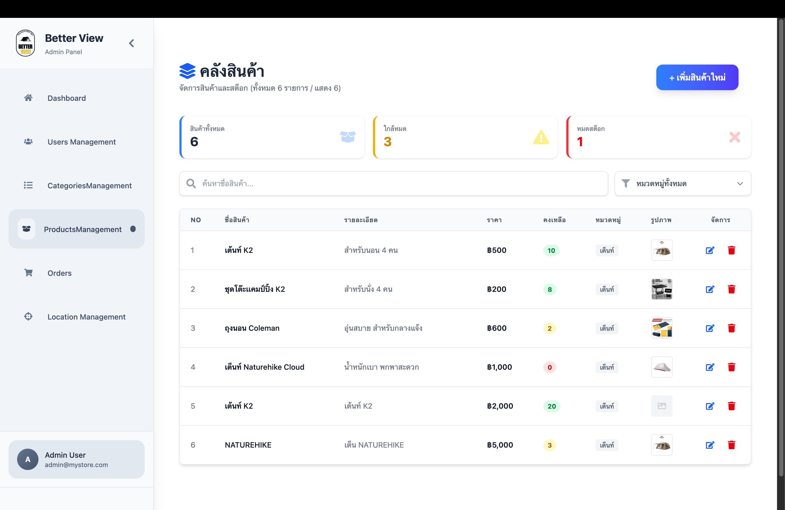
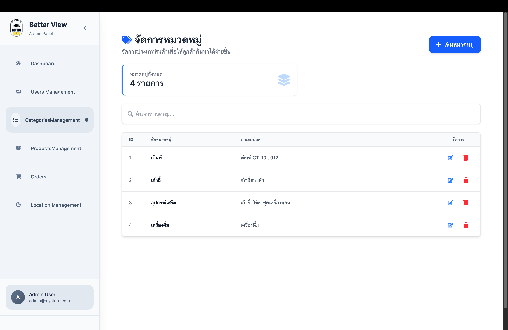
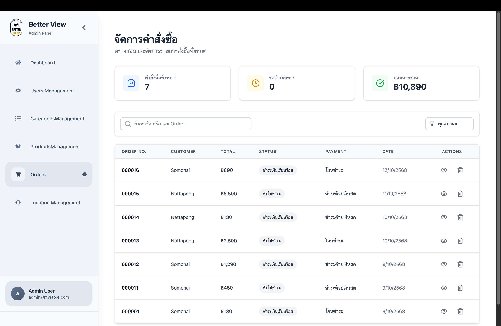
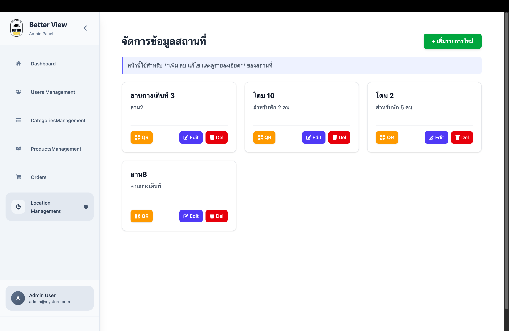

# Web Application System Manage

A web-based product management system with an interactive dashboard for monitoring and managing product data.

## 🔹 Overview
This project is a web application designed to manage products and display key information through a dashboard interface. It demonstrates frontend development skills including state management, CRUD operations, and responsive UI design.

## 🔹 Features
- Dashboard Manage
  
- Product listing page with API integration and full CRUD functionality
  
- Product detail view
- Categories management system with CRUD functionality
  
- Order management system with CRUD functionality
  
- Location Management system with CRUD functionality
  
- Responsive design

## 🔹 Tech Stack
- React.js
- Node Js
- JavaScript 
- REST API (Express Js)
- Taiwind CSS

## 🔹 Installation
npm install
npm run dev

## 🔹 Run server
npm start
